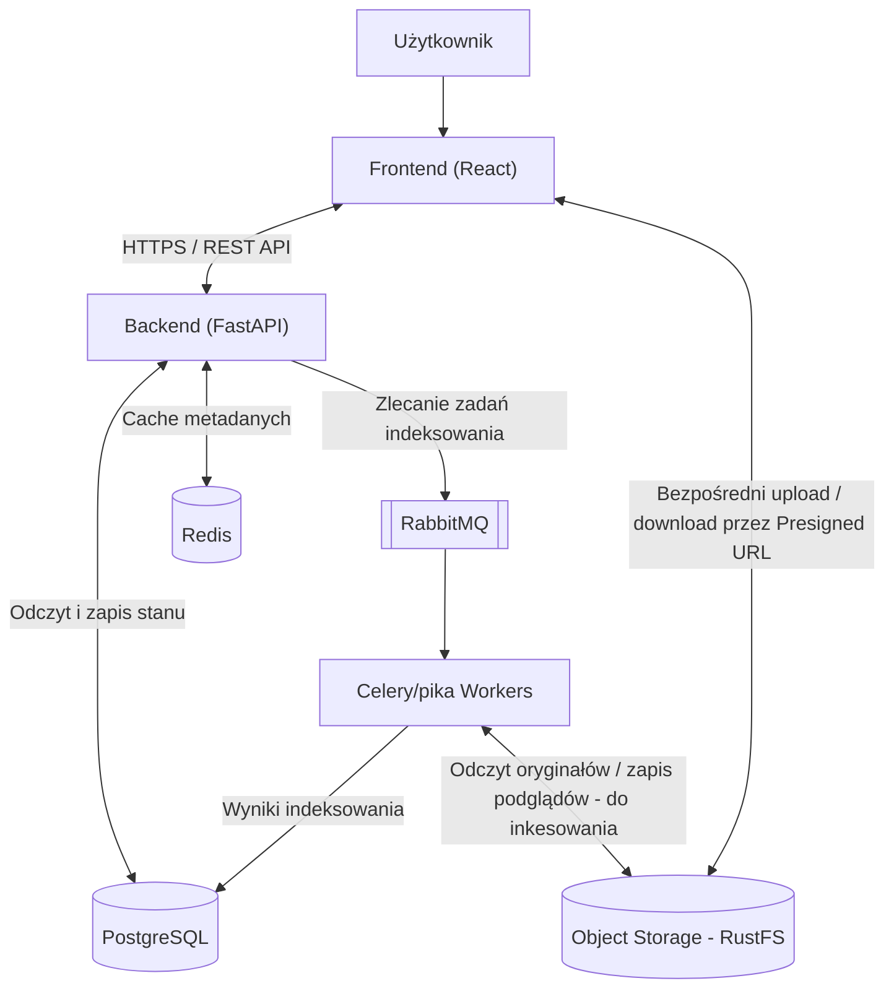
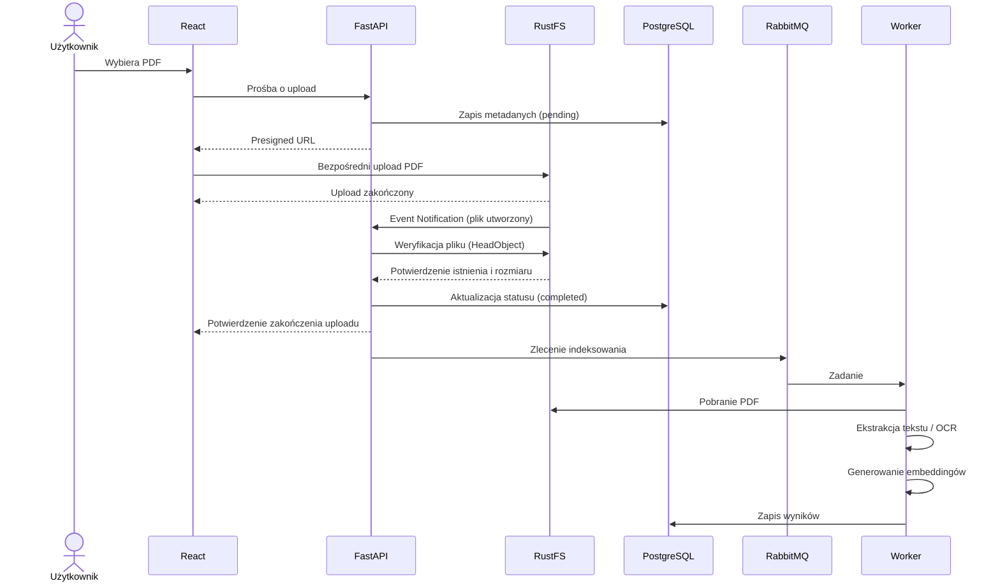

# Diagrams

## Architecture

```mermaid
flowchart TB
    U["Użytkownik"] --> FE["Frontend (React)"]

    FE <-->|"HTTPS / REST API "| BE["Backend (FastAPI)"]

    BE <-->|"Odczyt i zapis stanu"| DB[("PostgreSQL")]
    BE <-->|"Cache metadanych"| REDIS[("Redis")]

    FE <-->|"Bezpośredni upload / download przez Presigned URL"| OS[("Object Storage - RustFS")]

    BE -->|"Zlecanie zadań indeksowania"| MQ[["RabbitMQ"]]
    MQ --> WORKER["Celery/pika Workers"]

    WORKER -->|"Wyniki indeksowania"| DB
    WORKER <-->|"Odczyt oryginałów / zapis podglądów - do inkesowania"| OS

```

## Interactions

```mermaid
sequenceDiagram
    actor User as Użytkownik
    participant FE as React
    participant BE as FastAPI
    participant OS as RustFS
    participant DB as PostgreSQL
    participant MQ as RabbitMQ
    participant W as Worker

    User->>FE: Wybiera PDF
    FE->>BE: Prośba o upload
    BE->>DB: Zapis metadanych (pending)
    BE-->>FE: Presigned URL

    FE->>OS: Bezpośredni upload PDF
    OS-->>FE: Upload zakończony

    OS->>BE: Event Notification (plik utworzony)
    BE->>OS: Weryfikacja pliku (HeadObject)
    OS-->>BE: Potwierdzenie istnienia i rozmiaru
    BE->>DB: Aktualizacja statusu (completed)

    BE-->>FE: Potwierdzenie zakończenia uploadu

    BE->>MQ: Zlecenie indeksowania
    MQ->>W: Zadanie
    W->>OS: Pobranie PDF
    W->>W: Ekstrakcja tekstu / OCR
    W->>W: Generowanie embeddingów
    W->>DB: Zapis wyników

```